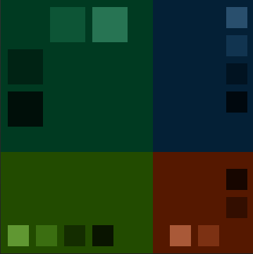

<a name="readme-top"></a>

<!-- PROJECT DETAILS -->
<div align="center">

  <h1 align="center">The SYSTRON Lab Website</h1>

  <p align="center">
    Home of the <a href="https://systronlab.github.io"><strong>SYSTRON Lab</strong></a>
    <br />
    based in the <a href="https://www.cs.york.ac.uk/"><strong>Department of Computer Science</strong></a> at the University of York
  </p>
</div>


<!-- TABLE OF CONTENTS -->
<details>
  <summary>Table of Contents</summary>
  <ol>
    <li>
      <a href="#about-this-repository">About this Repository</a>
    </li>
    <li>
      <a href="#adding-and-updating-content">Adding and Updating Content</a>
      <ul>
        <li><a href="#adding-a-new-opportunity">Adding a new Opportunity</a></li>
        <li><a href="#adding-a-new-person">Adding a new Person</a></li>
      </ul>
    </li>
    <li>
      <a href="#modifying-the-template">Modifying the Template</a>
      <ul>
        <li><a href="#prerequisites">Prerequisites</a></li>
      </ul>
    </li>
    <li>
      <a href="#systron-brand">SYSTRON Brand</a>
    </li>
  </ol>
</details>


<!-- ABOUT THIS REPOSITORY -->
## About this Repository

This repository holds the files that provide the SYSTRON Lab website, which is powered by GitHub Pages. The site is written in Jekyll, making it a combination of HTML/CSS/JS and also markdown pages.

To update the site, simply follow the instructions in the rest of this document.

<p align="right">(<a href="#readme-top">back to top</a>)</p>


<!-- ADDING AND UPDATING CONTENT -->
## Adding and Updating Content

This site is primarily written using markdown. When you commit a new markdown file, it will automatically be processed by Jekyll into a webpage, making it incredibly simple to add new content.

You can update content by modifying the site's markdown files, which all end in `.md`. These are housed in the root directory, or in:

- `_opportunities` for job, PhD or research opportunities
- `_people` for members of the SYSTRON team
- `_publications` for research outputs (with supporting files, such as PDFs, in `/files/publications/`)
- `_research` for research themes
- `news/_posts` for news items

### Adding a new Opportunity

Make a copy of the template `_opportunities/template.md` and complete the mandatory fields:

- `title`, such as what the position will be
- `date` of publication
- `closing`, when the applicant must apply before

Then add an overview of the role, or the role description, to the main body. These can by stylised using markdown or HTML.

You can optionally add:

- `subtitle`, such as the research theme or funder
- `salary`, the advertised salary bracket
- `link` to an external place to apply
- `background` to provide a background image (also used in Twitter, Facebook and LinkedIn cards)

### Adding a new Person

Make a copy of the template `_people/template.md` and complete the mandatory fields:

- `name`, the person's name
- `role`, the person's role

Then add a short description of the person and/or their resarch to the main body of the file.

You can optionally add:

- `photo`, the path to a person's photo, if uploaded to `/img/people`. If this isn't present, it'll default to a placeholder image
- `site`, the person's personal website

<p align="right">(<a href="#readme-top">back to top</a>)</p>

<!-- MODIFYING THE TEMPLATE -->
## Modifying the Template

This site is written in Jekyll, and then published to GitHub Pages. To modify the underlying template, you can edit the HTML files and publish these as commits, but it is recommended to create a local copy and test these changes first.

### Prerequisites

- Ruby (2.5.0+)
- RubyGems

Install Jekyll and Bundler:

```bash
gem install jekyll bundler
```

Then in the same directory as this site's files, run:

```bash
bundle exec jekyll serve
```

This should run a local copy of the site, accessible from `localhost:4000`.

<p align="right">(<a href="#readme-top">back to top</a>)</p>

<!-- SYSTRON BRAND -->
## SYSTRON Brand

### Colour Palette



```css
*** Primary color:
   shade 0 = #003A21 = rgb(  0, 58, 33) = rgba(  0, 58, 33,1) = rgb0(0,0.227,0.129)
   shade 1 = #277453 = rgb( 39,116, 83) = rgba( 39,116, 83,1) = rgb0(0.153,0.455,0.325)
   shade 2 = #0D5536 = rgb( 13, 85, 54) = rgba( 13, 85, 54,1) = rgb0(0.051,0.333,0.212)
   shade 3 = #002314 = rgb(  0, 35, 20) = rgba(  0, 35, 20,1) = rgb0(0,0.137,0.078)
   shade 4 = #000F09 = rgb(  0, 15,  9) = rgba(  0, 15,  9,1) = rgb0(0,0.059,0.035)

*** Secondary color (1):
   shade 0 = #042036 = rgb(  4, 32, 54) = rgba(  4, 32, 54,1) = rgb0(0.016,0.125,0.212)
   shade 1 = #294F6D = rgb( 41, 79,109) = rgba( 41, 79,109,1) = rgb0(0.161,0.31,0.427)
   shade 2 = #113450 = rgb( 17, 52, 80) = rgba( 17, 52, 80,1) = rgb0(0.067,0.204,0.314)
   shade 3 = #011321 = rgb(  1, 19, 33) = rgba(  1, 19, 33,1) = rgb0(0.004,0.075,0.129)
   shade 4 = #00080E = rgb(  0,  8, 14) = rgba(  0,  8, 14,1) = rgb0(0,0.031,0.055)

*** Secondary color (2):
   shade 0 = #224B00 = rgb( 34, 75,  0) = rgba( 34, 75,  0,1) = rgb0(0.133,0.294,0)
   shade 1 = #609732 = rgb( 96,151, 50) = rgba( 96,151, 50,1) = rgb0(0.376,0.592,0.196)
   shade 2 = #3B6E11 = rgb( 59,110, 17) = rgba( 59,110, 17,1) = rgb0(0.231,0.431,0.067)
   shade 3 = #142D00 = rgb( 20, 45,  0) = rgba( 20, 45,  0,1) = rgb0(0.078,0.176,0)
   shade 4 = #091400 = rgb(  9, 20,  0) = rgba(  9, 20,  0,1) = rgb0(0.035,0.078,0)

*** Complement color:
   shade 0 = #551800 = rgb( 85, 24,  0) = rgba( 85, 24,  0,1) = rgb0(0.333,0.094,0)
   shade 1 = #A95938 = rgb(169, 89, 56) = rgba(169, 89, 56,1) = rgb0(0.663,0.349,0.22)
   shade 2 = #7C3113 = rgb(124, 49, 19) = rgba(124, 49, 19,1) = rgb0(0.486,0.192,0.075)
   shade 3 = #330E00 = rgb( 51, 14,  0) = rgba( 51, 14,  0,1) = rgb0(0.2,0.055,0)
   shade 4 = #170600 = rgb( 23,  6,  0) = rgba( 23,  6,  0,1) = rgb0(0.09,0.024,0)
```

<p align="right">(<a href="#readme-top">back to top</a>)</p>